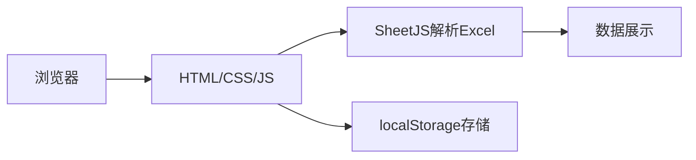
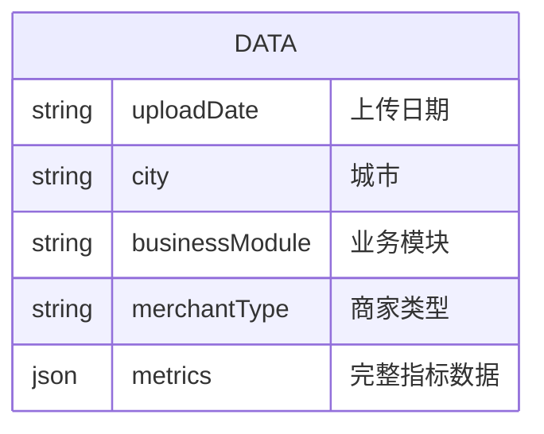

## 1. Architecture Design
纯前端应用，Excel解析在浏览器端完成，使用localStorage存储数据



## 2. Technology Description
- Frontend: 纯HTML + CSS + JavaScript (无需框架)
- Excel解析: SheetJS (xlsx)
- 本地存储: localStorage
- 数据可视化: 原生HTML表格（暂不使用图表库，保持简洁）

## 3. Route Definitions
无需路由，单页面应用，通过Tab切换不同视图

## 4. API Definitions
无需后端API

## 5. Server Architecture Diagram
无后端

## 6. Data Model
### 6.1 Data Model Definition


### 6.2 数据存储格式
```javascript
// localStorage key: financialData
{
  "cities": ["总商", "承德", "围场", "康保", "玉田", "安国", "安平", "献县", "威县", "晋州", "深泽"],
  "modules": ["全品类", "餐饮", "闪购", "医药", "拼好饭"],
  "merchantTypes": ["全量商家", "KA商家", "城市商家"],
  "uploads": [
    {
      "date": "2026-05-19",
      "data": {
        // 各城市各模块的完整数据
      }
    }
  ]
}
```

### 6.3 指标层级结构
```javascript
const metricHierarchy = {
  "体量指标": {
    "订单量汇总": ["加盟订单量", "自配订单量", "企客订单量"],
    "原价交易额汇总": ["加盟原价交易额", "自配原价交易额"]
  },
  "收入指标": {
    "抽佣金额汇总": ["加盟抽佣金额", "自配抽佣金额", "企客商家抽佣金额"],
    "配送费汇总": ["加盟配送费", "二次配送费", "企客配送费", "一对一急送配送费"],
    "其他收入汇总": [],
    "线上收入汇总": []
  },
  // ... 更多指标层级
};
```
